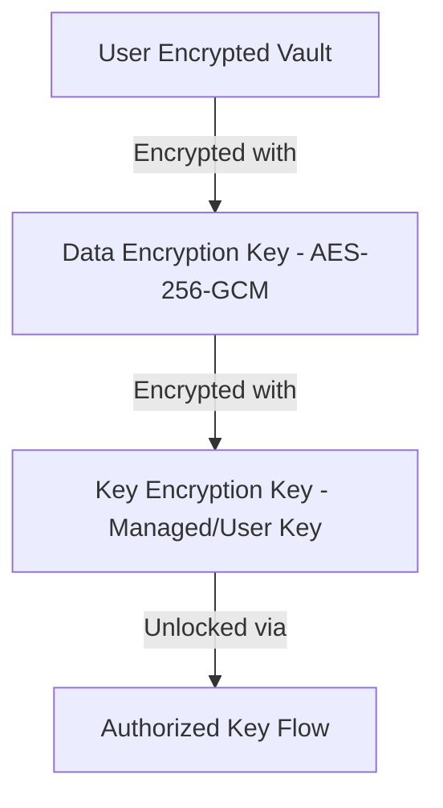

# VexCTX Refinement & Product Plan

This document outlines the product concept, architecture, boundaries, encryption model, pricing, and launch phases for VexCTX—a local-first memory product for AI-assisted work.

---

## 1. Product Concept

**VexCTX** is a local-first memory layer for AI-assisted workflows. It records AI interactions, stores them in an encrypted, portable vault owned by the user, and provides a utility to retrieve specific logs, timelines, and summaries. 

The product is divided into a trust-building acquisition layer (VexCTX Vault) and an intelligence-based monetization layer (VexCTX Retrieve).

---

## 2. Product Structure

### Free Product: VexCTX Vault
**Core Promise:** *“Everything your AI helped you do, saved into a portable encrypted memory vault you own.”*

* **Capture AI activity only** (not full device surveillance).
* **Local encrypted vault file** (fully owned and controlled by the user).
* **Export & Download** the vault at any time.
* **Import** vaults back into VexCTX.
* **Basic local timeline / history playback**.
* **Full vault export** for compatibility with other AI tools or software.

#### What gets captured:
* AI prompts and responses.
* AI-generated file edits and artifacts.
* AI-suggested commands and approved actions.
* AI-linked searches and research notes.
* Project and session metadata.

### Paid Product: VexCTX Retrieve
**Core Promise:** *“Find the exact memory you need from your encrypted AI work history.”*

* **Semantic search** across the encrypted vault.
* **Selective chunk retrieval** (breaking history into smaller segments for search/context injection).
* **Metadata queries** (by project, date range, app, file, command, or task).
* **Agent-ready context bundles** for external coding tools and LLMs.
* **Summarization capabilities** (e.g., *"What did AI help me do on Project X last week?"*).
* **Filtered exports** (e.g., *"Only Redis-related debugging sessions"*).
* **Structured context injection** for other AI agents.

> [!IMPORTANT]
> Users are not paying to access their own data. They are paying for the *intelligence layer* that decrypts, indexes, chunks, and searches it.

---

## 3. Trust & Encryption

To establish trust, VexCTX utilizes envelope encryption where the vault is always encrypted, the user owns the vault file, and retrieval requires an authorized key flow.

### Encryption Architecture

* **AES-256-GCM** for high-performance vault encryption.
* **Envelope Encryption**: 
  - One random **Data Encryption Key (DEK)** per vault or per vault segment.
  - DEK is encrypted with a **Key Encryption Key (KEK)**.
  - The encrypted vault, encrypted DEK, and metadata manifest are stored together.

### Roadmap

* **V1 (Current/Next Phase)**: DEK encrypted with a VexCTX-managed KEK.
* **V2 (Future)**: User recovery/controlled unlock flow, customer-managed keys (CMK), and Enterprise BYOK (Bring Your Own Key) for compliance.

---

## 4. Pricing Model

| Tier | Price Model | Included Features |
|---|---|---|
| **Free** | $0 | Capture, encrypt, store, export, import, basic local history |
| **Pro** | Low monthly | Chunk retrieval, semantic search, summaries, filtered exports |
| **Team** | Higher monthly | Shared vaults, access controls, audit trails, workspace search |
| **Enterprise** | Custom | BYOK, policy controls, custom retention, compliance features |

### Metered / Usage Alternative for Retrieve
* **X** free retrievals/searches per month.
* Pay-per-retrieval packs or pricing based on indexed vault size.

---

## 5. Product Boundaries

| In Scope | Out of Scope (By Default) |
|---|---|
| AI-assisted actions & logs | Full-device background surveillance |
| Prompt & response memory | Password managers, financial/banking apps |
| AI-caused file edits & outputs | Silent clipboard capture (opt-in only) |
| AI workflow metadata & retrieval | Raw screen/total-monitor recording |

---

## 6. Technical Architecture

### Vault side
* **Local Event Collector**: Background service logging interactions.
* **Structured Event Store**: Local storage (SQLite/LanceDB/Files).
* **Sync Layer**: Optional cloud synchronization of encrypted vault blobs.
* **Manifest File**: Contains version, timestamps, source apps, and chunk index markers.

### Retrieve side
* **Ingest Service**: Temporary decrypter/indexer for authorized sessions.
* **Chunking/Indexing Engine**: Splits long history streams into semantic, queryable chunks.
* **Query Resolver**: Executes semantic vector search and attribute filtering.
* **Output Formatter**: Generates summaries, timelines, or agent-ready JSON/Markdown bundles.

---

## 7. Recommended Launch Order

### Phase 1 — VexCTX Vault
- Local encrypted vault creation.
- AI-assisted event logging.
- Export and import tools.
- Basic local timeline interface.
- Granular privacy controls.

### Phase 2 — VexCTX Retrieve
- Paid selective chunk retrieval.
- Semantic vector-based search.
- Date, project, and metadata filters.
- Summary generation engine.

### Phase 3 — VexCTX Pro / Team
- Cloud sync of encrypted vaults.
- Shared vaults and access control lists (ACLs).
- Audit trails for workspace security.

### Phase 4 — Vexon OS Merge
- Seamless merge as the native persistent context layer inside Vexon OS.
- Allows all OS-level apps to read/write context through the same substrate.

---

## 8. Messaging Guidelines

### Pitch Options
* **Short Pitch**: *"VexCTX records everything AI helped you do into an encrypted portable memory vault, then lets you retrieve the exact pieces you need on demand."*
* **Alternative**: *"Own your AI work history. Search it when it matters."*

### Words to Avoid
* 🚫 *"We hold the key."*
* 🚫 *"Pay to unlock your own data."*
* 🚫 *"We log everything you do."*
